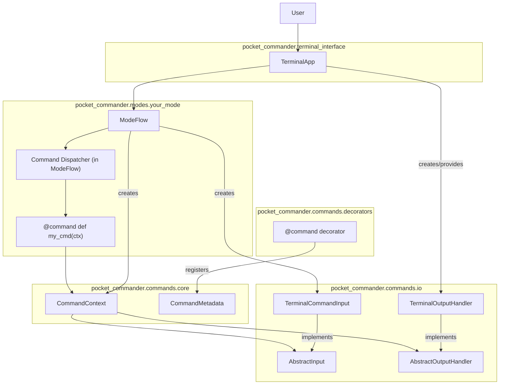
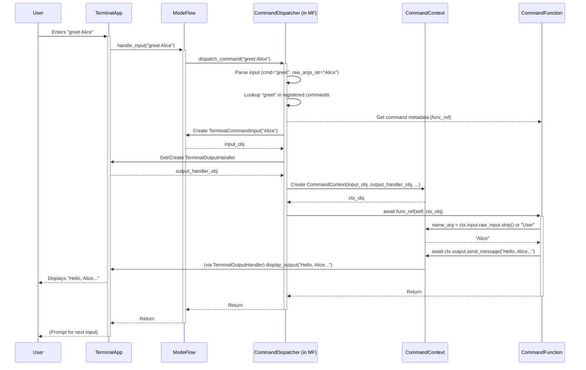

# Plan: Enhanced Command Execution System for Pocket Commander

## 1. Goal

To implement a robust and flexible command execution system within Pocket Commander modes. This system will allow commands to be defined as annotated Python functions with abstracted input/output mechanisms, enhancing the extensibility and power of modes.

## 2. Core Design Choices (User Confirmed)

*   **Command Naming:** Mode-specific commands will be **bare words** (e.g., `greet`), distinct from built-in `/` prefixed commands.
*   **Argument Parsing:** Initial implementation will use **simple space-splitting** for arguments. The `AbstractCommandInput` will manage this. Enhancements can be made later.
*   **Asynchronous Commands:** All command functions defined with the `@command` decorator must be `async def`.
*   **Error Handling:** Command functions are responsible for catching their own exceptions, logging them (e.g., via `CommandContext`), and using `ctx.output.send_message()` or `ctx.output.send_error()` for user-friendly reporting.
*   **Command Scope:** Commands will be strictly **local** to the mode in which they are defined.

## 3. Phased Implementation Plan

### Phase 1: Core Abstractions & Command Definition

1.  **`CommandMetadata` Data Class** ([`pocket_commander/commands/core.py`](pocket_commander/commands/core.py:1)):
    *   Stores: `name: str`, `func: Callable`, `description: str`, `aliases: List[str] = None`.
2.  **Abstract Input/Output Interfaces** ([`pocket_commander/commands/io.py`](pocket_commander/commands/io.py:1)):
    *   `AbstractCommandInput`:
        *   `get_argument(name: str, type: Type = str, default: Any = None) -> Any`
        *   `get_all_arguments() -> Dict[str, Any]`
        *   `raw_input: Any`
    *   `AbstractOutputHandler`:
        *   `send_message(message: Any, style: Optional[str] = None)`
        *   `send_error(message: Any, details: Optional[str] = None)`
        *   `send_data(data: Any, format_hint: Optional[str] = None)`
3.  **`CommandContext` Class** ([`pocket_commander/commands/core.py`](pocket_commander/commands/core.py:1)):
    *   Passed to command functions.
    *   Attributes: `input: AbstractCommandInput`, `output: AbstractOutputHandler`, `mode_name: str`, `terminal_app: 'TerminalApp'`, `mode_flow: Any`, `loop: asyncio.AbstractEventLoop`.
4.  **`@command` Decorator** ([`pocket_commander/commands/decorators.py`](pocket_commander/commands/decorators.py:1)):
    *   `@command(name: str, description: str, aliases: List[str] = None)`
    *   Attaches `CommandMetadata` to the decorated function (e.g., as `func._command_metadata`).

### Phase 2: Command Registration and Dispatch

1.  **Command Registry (Per Mode):**
    *   Mode flow classes (e.g., `MainModeFlow`) will discover commands by inspecting methods for `_command_metadata`.
    *   A helper like `_discover_commands() -> Dict[str, CommandMetadata]` in mode flows.
2.  **Command Dispatcher Logic (within Mode Flow's `handle_input` or a dedicated method):**
    *   Parse raw input string for command name and arguments.
    *   Look up command in the mode's registry.
    *   If found: Create `CommandInput`, `CommandContext`, and invoke the command function.
    *   If not found: Pass to default handler (e.g., LLM or echo).

### Phase 3: Terminal I/O Implementation

1.  **`TerminalCommandInput`** ([`pocket_commander/commands/terminal_io.py`](pocket_commander/commands/terminal_io.py:1) or [`pocket_commander/commands/io.py`](pocket_commander/commands/io.py:1)):
    *   Subclass of `AbstractCommandInput`. Parses raw terminal string.
2.  **`TerminalOutputHandler`** ([`pocket_commander/commands/terminal_io.py`](pocket_commander/commands/terminal_io.py:1) or [`pocket_commander/commands/io.py`](pocket_commander/commands/io.py:1)):
    *   Subclass of `AbstractOutputHandler`. Uses `TerminalApp.display_output()`.

### Phase 4: Integration into `TerminalApp` and Modes

1.  **Modify `TerminalApp`** ([`pocket_commander/terminal_interface.py`](pocket_commander/terminal_interface.py:1)):
    *   Ensure `TerminalOutputHandler` is correctly instantiated and made available to `CommandContext`.
2.  **Modify Mode Flows** (e.g., [`pocket_commander/modes/main/main_flow.py`](pocket_commander/modes/main/main_flow.py:1)):
    *   Implement `_discover_commands()` method.
    *   Update `handle_input` to include command dispatch logic.
    *   Example of command registration in `__init__`:
        ```python
        # Example in a mode flow class
        import inspect
        # ...
        def __init__(self, mode_config, terminal_app_instance):
            # ... existing init ...
            self._commands = self._discover_commands()

        def _discover_commands(self) -> Dict[str, CommandMetadata]:
            cmds = {}
            for name, member in inspect.getmembers(self):
                if callable(member) and hasattr(member, '_command_metadata'):
                    meta = member._command_metadata
                    cmds[meta.name] = meta # Using bare name as per decision
                    if meta.aliases:
                        for alias in meta.aliases:
                            cmds[alias] = meta
            return cmds
        ```

### Phase 5: Example & Documentation

1.  **Update `MainModeFlow` with an Example Command:**
    ```python
    # In MainModeFlow class
    from pocket_commander.commands.decorators import command
    from pocket_commander.commands.core import CommandContext

    @command(name="greet", description="Greets the user.")
    async def greet_command(self, ctx: CommandContext):
        # Assuming simple space-split args for now, accessed via ctx.input
        # Example: args = ctx.input.get_all_arguments().get("args_list", [])
        # name_arg = args[0] if args else "User"
        # For a more structured approach with get_argument:
        # For "greet Alice", TerminalCommandInput might parse it as command="greet", _raw_args_str="Alice"
        # Then get_argument would need to be smarter or we'd parse explicitly.
        # For simple space splitting, let's assume args are passed as a list.
        
        # Simplistic parsing for initial bare-word commands:
        # The CommandInput instance would receive the full "arg1 arg2 ..." part.
        # It's up to the command to parse this further for now.
        
        raw_args_str = ctx.input.raw_input # This would be the part after the command word
        name_arg = raw_args_str.strip() if raw_args_str.strip() else "User"
        
        await ctx.output.send_message(f"Hello, {name_arg} from Main Mode!")
    ```
2.  **Documentation:**
    *   This file (`docs/command_system_plan.md`) serves as the primary plan.
    *   Update `cline_docs/systemPatterns.md` and `cline_docs/techContext.md` post-implementation.

## 4. Visual Plan (Mermaid Diagrams)

### Component Overview



### Input Handling Flow (Bare Word Command)



## 5. Next Steps

With this plan documented, the next step is to begin implementation, likely starting with Phase 1 (Core Abstractions).