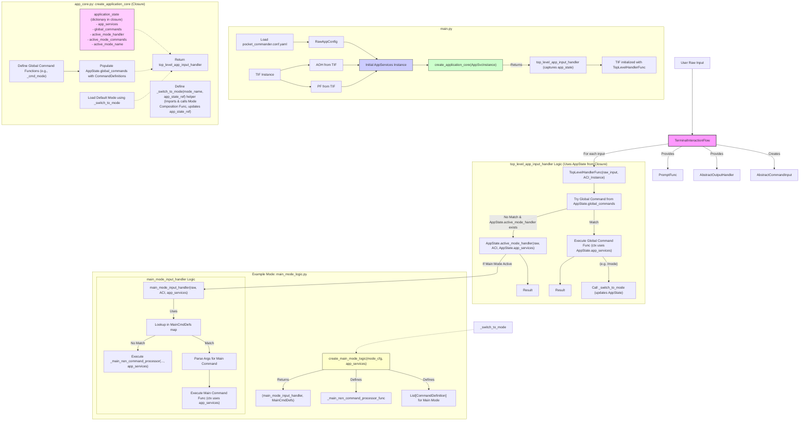

# Plan v8.3: Fully Functional Composition for Application Core and Modes

This plan outlines a purely functional composition architecture for Pocket Commander, encompassing both the application core and individual modes. It emphasizes clear I/O abstractions, declarative command registration, and state management within closures.

## Core Principles

1.  **Centralized I/O Initialization**:
    *   `TerminalInteractionFlow` is instantiated in `main.py`. It is the primary source for `output_handler: AbstractOutputHandler` and `prompt_func: PromptFunc`.
2.  **`AppServices` Container**:
    *   A simple data structure (e.g., `typing.TypedDict` or `dataclasses.dataclass`) to pass essential services: `output_handler`, `prompt_func`, `raw_app_config` (loaded from YAML), and potentially a shared logger.
3.  **Command Definition**:
    *   `CommandDefinition` objects store metadata for each command: `name`, `description`, the `async` command function itself, `parameters: List[ParameterDefinition]`, and `aliases`. This structure is used for both global and mode-specific commands.
4.  **Mode Composition**:
    *   Each mode is defined by a "mode composition function" (e.g., `create_main_mode_logic` located in a file like `pocket_commander/modes/main_mode_logic.py`).
    *   This function:
        *   Receives `mode_config: Dict` (specific to that mode, from the main app config) and `app_services: AppServices`.
        *   Defines the mode's list of `CommandDefinition`s.
        *   Defines a "non-command processor function" (an `async` function) for that mode.
        *   Returns a tuple: `(mode_input_handler_func: Callable, command_definitions: List[CommandDefinition])`.
            *   `mode_input_handler_func(raw_input_str: str, command_input: AbstractCommandInput, app_services_for_mode: AppServices)`: An `async` function that processes input *for this specific mode*. It uses the provided `app_services_for_mode` to build `CommandContext` for its commands or to pass to its non-command processor.
5.  **Application Core Composition (`create_application_core`)**:
    *   This is the top-level composition function, called once from `main.py`.
    *   It's defined in a new file, e.g., `pocket_commander/app_core.py`.
    *   Receives `initial_app_services: AppServices`.
    *   Manages an `application_state` dictionary (mutable, captured in a closure). This state includes:
        *   `app_services: AppServices` (the services passed in, including `raw_app_config`).
        *   `global_commands: Dict[str, CommandDefinition]`.
        *   `active_mode_name: Optional[str]`.
        *   `active_mode_handler: Optional[Callable]` (the `mode_input_handler_func` for the current mode).
        *   `active_mode_commands: List[CommandDefinition]`.
    *   Defines global command functions (e.g., `/exit`, `/help`, `/modes`, `/mode <name>`).
        *   The `/mode <name>` command's function will call a helper function (also within the `create_application_core` closure) to manage mode switching. This helper will:
            *   Use `application_state['app_services']['raw_app_config']` to find the target mode's configuration and module path.
            *   Dynamically import and call the target mode's composition function (passing `mode_config` from `raw_app_config` and `application_state['app_services']`).
            *   Update `application_state['active_mode_handler']`, `application_state['active_mode_commands']`, and `application_state['active_mode_name']`.
    *   Populates `application_state['global_commands']` with `CommandDefinition`s for these global commands.
    *   Attempts to load the default initial mode using the mode switching helper.
    *   Returns a single `async` function: `top_level_app_input_handler(raw_input_str: str, command_input: AbstractCommandInput)`. This handler operates on the `application_state` (which is in its closure).
6.  **`top_level_app_input_handler`**:
    *   This is the main entry point for each piece of user input, called by `TerminalInteractionFlow`.
    *   It uses the `application_state` (from its closure).
    *   It first tries to match and execute a global command from `application_state['global_commands']`.
        *   Global commands receive a `CommandContext` built using `application_state['app_services']`.
    *   If no global command matches and `application_state['active_mode_handler']` exists, it calls:
        `await application_state['active_mode_handler'](raw_input_str, command_input, application_state['app_services'])`.
7.  **Main Application Loop (`main.py`)**:
    *   Initializes `TerminalInteractionFlow`.
    *   Loads the raw application configuration (e.g., from `pocket_commander.conf.yaml`).
    *   Creates the initial `app_services` instance (with `output_handler` and `prompt_func` from `TerminalInteractionFlow`, and the loaded `raw_app_config`).
    *   Calls `top_level_input_processor = create_application_core(app_services)`.
    *   `TerminalInteractionFlow`'s main input loop calls this `top_level_input_processor` for each user input.

## Detailed Plan Phases

### Phase 1: Define Core Data Structures and I/O Abstractions
1.  **`AbstractCommandInput`** (`pocket_commander/commands/io.py`):
    *   Ensure methods: `get_command_word() -> Optional[str]`, `get_remaining_input() -> str`.
    *   Consider `get_arguments_as_dict() -> Dict[str, Any]` or similar for structured argument access if needed by the parser.
2.  **`AbstractOutputHandler`** (`pocket_commander/commands/io.py`):
    *   Verify methods: `send_message`, `send_error`, `send_data`.
3.  **`PromptFunc` Type Definition** (`pocket_commander/commands/io.py`):
    *   `from typing import Callable, Awaitable, Optional, Any; PromptFunc = Callable[[str, Optional[str]], Awaitable[str]]`.
4.  **`ParameterDefinition` and `CommandDefinition`** (`pocket_commander/commands/definition.py`):
    *   Define using Pydantic or dataclasses (see Plan v8.1 for structure).
5.  **`CommandContext`** (`pocket_commander/commands/core.py`):
    *   Ensure constructor accepts: `input: AbstractCommandInput`, `output: AbstractOutputHandler`, `prompt_func: PromptFunc`, `mode_name: str`, `terminal_app: Any` (the `app_services` or a specific part of it if preferred for context), and `loop: asyncio.AbstractEventLoop`.
6.  **`AppServices` TypedDict/Dataclass**:
    *   Define in a common types location (e.g., `pocket_commander/types.py`):
      ```python
      from typing import TypedDict, Callable, Awaitable, Optional, Any, Dict
      from .commands.io import AbstractOutputHandler, PromptFunc
      # Potentially a Logger type from logging module

      class AppServices(TypedDict):
          output_handler: AbstractOutputHandler
          prompt_func: PromptFunc
          raw_app_config: Dict[str, Any]
          # logger: Logger 
      ```

### Phase 2: Implement Mode Composition Logic
7.  **Mode Composition Function Structure**:
    *   For each mode, create a module (e.g., `pocket_commander/modes/main_mode_logic.py`).
    *   This module contains:
        *   Standalone `async` command functions.
        *   An `async` non-command processor function.
        *   The mode composition function (e.g., `create_main_mode_logic`) that accepts `(mode_config: Dict, app_services: AppServices)` and returns `(mode_input_handler_func, List[CommandDefinition])`.
        *   The returned `mode_input_handler_func` takes `(raw_input_str, command_input, app_services_for_mode)` and orchestrates command/non-command logic for that mode.
8.  **Argument Parsing Utility** (`pocket_commander/commands/parser.py`):
    *   Implement `async def parse_arguments(command_input: AbstractCommandInput, param_definitions: List[ParameterDefinition]) -> Dict[str, Any]`. Handles type casting, defaults, required checks, and raises errors on failure.

### Phase 3: Implement Application Core Composition Logic
9.  **Create `pocket_commander/app_core.py`**:
    *   Define `create_application_core(initial_app_services: AppServices) -> Callable[[str, AbstractCommandInput], Awaitable[Any]]`.
    *   Implement the logic described in "Core Principles" point #5, including:
        *   `application_state` dictionary (closure).
        *   Internal `_switch_to_mode` helper function.
        *   Definitions for global command functions.
        *   Population of `application_state['global_commands']`.
        *   Initial mode loading.
        *   Definition and return of `top_level_app_input_handler`.

### Phase 4: Update Main Application Entry Point and I/O Flow
10. **Update `pocket_commander/main.py`**:
    *   Follow "Core Principles" point #7: Instantiate `TerminalInteractionFlow`, load config, create `app_services`, call `create_application_core`, and pass the returned handler to `TerminalInteractionFlow`.
11. **Update `TerminalInteractionFlow`** (`pocket_commander/flows/terminal_interaction_flow.py`):
    *   Constructor: `__init__(self, process_input_callback: Callable[[str, AbstractCommandInput], Awaitable[Any]])`.
    *   Main loop: `await self.process_input_callback(user_input_str, command_input_obj)`.
    *   Implement `async def request_dedicated_input(self, prompt_message: str, style: Optional[str] = None) -> str:` for the `prompt_func`.

### Phase 5: Documentation and Review
12. **Update Documentation**:
    *   Thoroughly document the fully functional architecture: `AppServices`, `create_application_core`, `application_state` management, mode composition functions, and the data flow.
    *   Update `cline_docs/systemPatterns.md`, `cline_docs/techContext.md`, and `cline_docs/pocketflow-guides.md`.
13. **Review and Test**:
    *   Extensive testing of all components: global commands, mode switching, mode-specific commands, non-command processing, argument parsing, interactive prompts, and error handling.

## Mermaid Diagram (v8.3 - Fully Functional Composition)



This plan (v8.3) provides a highly decoupled, functional, and testable architecture for Pocket Commander's core logic and mode handling.