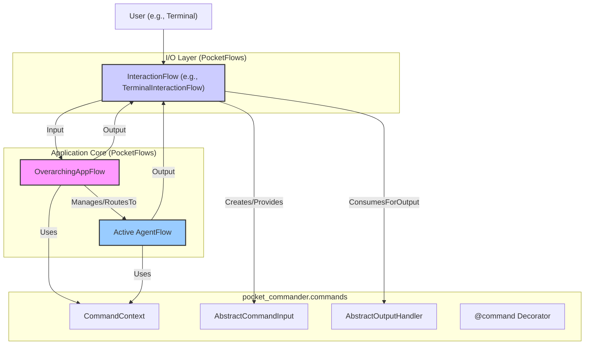
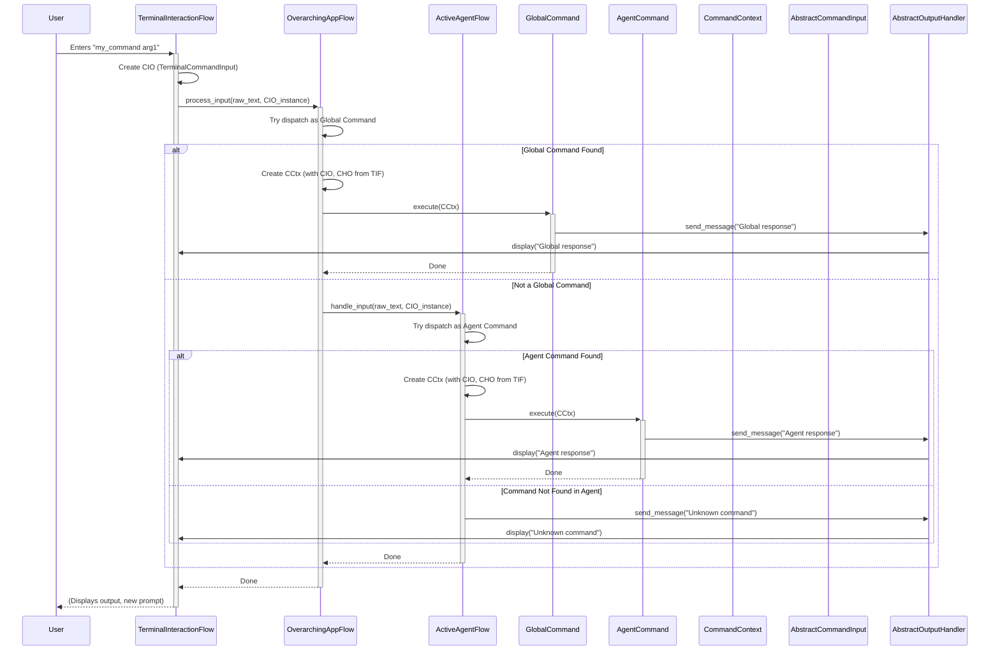

# Project Plan: PocketFlow-Centric Application Architecture

**Goal:** To refactor Pocket Commander into a fully PocketFlow-based architecture. This involves transforming the current `TerminalApp` into a `TerminalInteractionFlow`, introducing an `OverarchingAppFlow` to manage the application lifecycle and global commands, and ensuring all agents are also PocketFlows. The command system will use abstract I/O, making the terminal implementation replaceable.

**Key Architectural Principles:**

1.  **PocketFlow Core:** All major components (application shell, interaction layers, agents) will be implemented as PocketFlows or nodes within them.
2.  **Clear Separation of Concerns:**
    *   `OverarchingAppFlow`: Manages global state, application lifecycle, global commands, and orchestrates interaction and agent flows.
    *   `TerminalInteractionFlow` (and other potential InteractionFlows): Handles the specifics of user I/O for a given interface (e.g., terminal, web).
    *   `AgentFlows`: Encapsulate specific functionalities or agent behaviors, with their own local commands.
3.  **Abstracted I/O:** The command system (both global and agent-specific) will rely on `AbstractCommandInput` and `AbstractOutputHandler` as defined in `docs/command_system_plan.md`, allowing for different I/O backends.

---

### Phase 1: Core Flow Definitions & Enhanced I/O Abstractions

1.  **Define `OverarchingAppFlow` (`pocket_commander/flows/app_flow.py` - new file):**
    *   **Responsibilities:**
        *   Initialize and manage the application lifecycle.
        *   Load and manage configurations (agents, global settings).
        *   Instantiate and manage the active `InteractionFlow` (e.g., `TerminalInteractionFlow`).
        *   Instantiate, manage, and switch active `AgentFlows`.
        *   Register and dispatch global commands.
        *   Maintain global application state (e.g., current agent name).
    *   **Key Nodes (Conceptual):**
        *   `ConfigLoaderNode`: Loads `pocket_commander.conf.yaml`.
        *   `InteractionFlowManagerNode`: Instantiates and runs the chosen `InteractionFlow`.
        *   `AgentManagerNode`: Loads, switches, and manages `AgentFlows`.
        *   `GlobalCommandRegistryNode`: Holds global command definitions.
        *   `InputRouterNode`: Receives input from `InteractionFlow` and routes it to global command dispatcher or `AgentManagerNode`.

2.  **Define `TerminalInteractionFlow` (`pocket_commander/flows/terminal_interaction_flow.py` - new file, refactoring from `pocket_commander/terminal_interface.py`):**
    *   **Responsibilities:**
        *   Manage the `prompt-toolkit` session (input loop, history, auto-suggestion, completion).
        *   Capture raw user input from the terminal.
        *   Pass raw input to the `OverarchingAppFlow` for routing.
        *   Receive content from `AbstractOutputHandler` (via `CommandContext`) and display it using `rich.Console`.
    *   **Key Nodes (Conceptual):**
        *   `TerminalInputNode`: Uses `prompt-toolkit` to get user input asynchronously.
        *   `TerminalOutputNode`: Receives messages/data and uses `Console` to display them.
        *   This flow will effectively replace the `while True` loop in the current `TerminalApp.run()`.

3.  **Refine I/O Abstractions (`pocket_commander/commands/io.py`):**
    *   Review `AbstractCommandInput` and `AbstractOutputHandler`.
    *   `TerminalCommandInput`: Instantiated by `TerminalInteractionFlow` (or a node within it) based on raw string input.
    *   `TerminalOutputHandler`:
        *   Its `send_message`, `send_error`, `send_data` methods will need a way to signal the `TerminalInteractionFlow` (or its `TerminalOutputNode`) to display content. This could be via a shared queue, a callback, or by holding a reference to the `TerminalOutputNode`.
        *   The `TerminalApp.display_output` logic will move here or into `TerminalOutputNode`.

---

### Phase 2: Refactoring `TerminalApp` into Flows

1.  **Deconstruct `TerminalApp` (`pocket_commander/terminal_interface.py`):**
    *   The `TerminalApp` class will be largely dismantled or significantly simplified.
    *   `load_config()`: Logic moves to `OverarchingAppFlow`'s `ConfigLoaderNode`.
    *   `set_initial_agent()`: Logic moves to `OverarchingAppFlow`'s `AgentManagerNode` (called after config loading).
    *   `switch_agent()`: Logic moves to `OverarchingAppFlow`'s `AgentManagerNode`.
    *   `display_output()`: Logic moves to `TerminalOutputHandler` / `TerminalInteractionFlow`'s `TerminalOutputNode`.
    *   `handle_builtin_command()`: This logic will be split. Global commands (like `/agent`, `/agents`, `/help`) will be handled by `OverarchingAppFlow`.
    *   `run()`: The main loop logic is replaced by the execution of `OverarchingAppFlow` which in turn runs `TerminalInteractionFlow`.

2.  **Entry Point (`pocket_commander/main.py`):**
    *   Will be updated to instantiate and run the `OverarchingAppFlow`.
    *   `asyncio.run(app.run())` will become something like `asyncio.run(overarching_app_flow.start())`.

---

### Phase 3: Integrating the Command System

1.  **Global Command Handling (in `OverarchingAppFlow`):**
    *   `OverarchingAppFlow` will have its own command registry (similar to agent flow's registry in `docs/command_system_plan.md`).
    *   Commands like `/exit`, `/help`, `/agents`, `/agent <name>` will be defined as global commands (e.g., methods in `OverarchingAppFlow` decorated with `@command`).
    *   The `InputRouterNode` in `OverarchingAppFlow` will:
        *   Receive input from `TerminalInteractionFlow`.
        *   Attempt to parse and dispatch it as a global command.
        *   If not a global command, pass it to the `AgentManagerNode` for the active `AgentFlow`.
    *   `CommandContext` for global commands will be created by `OverarchingAppFlow`, providing the active `TerminalCommandInput` and `TerminalOutputHandler` (sourced from/via `TerminalInteractionFlow`).

2.  **Agent-Specific Command Handling:**
    *   Remains largely as per `docs/command_system_plan.md`.
    *   `AgentFlows` will register and dispatch their local commands.
    *   `CommandContext` for agent commands will be created by the `AgentFlow`, also using the active I/O handlers.

3.  **Command Completer Update:**
    *   The `WordCompleter` in `TerminalInteractionFlow` will need to be dynamically updated with:
        *   Global command names (from `OverarchingAppFlow`).
        *   Active agent's command names (from the current `AgentFlow`).
        *   Agent names (for the `/agent` command).

---

### Phase 4: Agent Integration as PocketFlows

1.  **Agent Definition:**
    *   Each agent (e.g., `main`, `composer`) will be a self-contained PocketFlow.
    *   The `get_flow(agent_config, app_instance)` signature in agent `__init__.py` files will change. `app_instance` might become `overarching_app_flow_instance` or it might receive specific delegates/interfaces for interaction (like access to I/O handlers or a way to request agent switches).

2.  **Agent Loading and Switching (in `OverarchingAppFlow`'s `AgentManagerNode`):**
    *   Uses the configuration to discover and instantiate `AgentFlows`.
    *   Handles teardown of the old agent flow and setup of the new one during a switch.

---

### Phase 5: Visual Plan (Mermaid Diagrams)

#### High-Level Architecture

#### Command Dispatch Flow (Simplified)

---

### Phase 6: Implementation Steps & Considerations

1.  **Create Core Flow Skeletons:** Start with `OverarchingAppFlow` and `TerminalInteractionFlow`.
2.  **Implement I/O Abstraction:** Ensure `TerminalCommandInput` and `TerminalOutputHandler` are robust and integrate with `TerminalInteractionFlow`.
3.  **Migrate Config Loading & Basic Terminal Loop:** Move this from `TerminalApp` to the new flows.
4.  **Implement Global Command Dispatch:** In `OverarchingAppFlow`.
5.  **Refactor Agent Loading/Switching:** In `OverarchingAppFlow`.
6.  **Update `main.py`:** To launch the new `OverarchingAppFlow`.
7.  **Test Thoroughly:** At each step, especially I/O and command dispatch.
8.  **Documentation:** Update `cline_docs/` (`systemPatterns.md`, `techContext.md`) to reflect the new architecture.