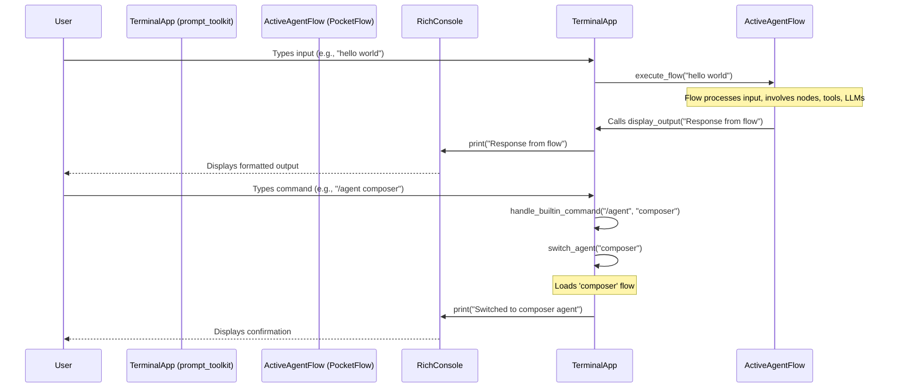

# Plan: Terminal Interface for PocketFlow

This plan outlines the steps to create a terminal interface for PocketFlow, allowing users to interact with different "agents," each backed by a specific PocketFlow flow.

**I. Core Objectives:**

1.  Develop a terminal interface using `prompt_toolkit` for input and `rich` for output.
2.  Implement basic commands: `/help`, `/commands`, `/agents`.
3.  Allow dynamic loading and switching of agents (e.g., `agent <agent_name>`).
4.  Configure agents in `pocket_commander.conf.yaml`, specifying the flow, LLM profile, etc.
5.  Structure agents as Python modules within `pocket_commander/agents/`, each exporting its flow.
6.  Pass terminal interaction to the active agent's PocketFlow flow.
7.  Implement initial agents: `main` and `composer`.

**II. Proposed Project Structure Changes:**

```
pocket_commander/
├── __init__.py
├── main.py                 # Existing main, may need adjustment or be entry point for terminal
├── terminal_interface.py   # NEW: Core logic for the terminal
├── agents/                  # NEW: Directory for all agents
│   ├── __init__.py
│   ├── main/               # NEW: Example 'main' agent
│   │   ├── __init__.py     # Exports the agent's flow
│   │   ├── main_flow.py    # PocketFlow definition for 'main' agent
│   │   └── (other_agent_specific_files.py)
│   └── composer/           # NEW: Example 'composer' agent
│       ├── __init__.py     # Exports the agent's flow
│       ├── composer_flow.py # PocketFlow definition for 'composer' agent
│       └── (other_agent_specific_files.py)
├── nodes/
│   └── ... (existing nodes)
├── flows/
│   └── ... (existing flows, can be reused by agents)
├── pocketflow/
│   └── ... (existing pocketflow core)
├── tools/
│   └── ... (existing tools)
├── utils/
│   └── ... (existing utils)
└── cline_docs/
    └── ... (existing docs)
pocket_commander.conf.yaml   # To be updated with agent configurations
poetry.lock
pyproject.toml              # To be updated with new dependencies
README.md
...
```

**III. Detailed Steps:**

**Phase 1: Setup & Core Terminal Framework**

1.  **Update Dependencies:**
    *   Add `prompt-toolkit` and `rich` to `pyproject.toml`.
    *   Run `poetry lock` and `poetry install`.
2.  **Configuration (`pocket_commander.conf.yaml`):**
    *   Define a new top-level key, e.g., `terminal_agents`.
    *   Under this key, list each agent with its configuration:
        ```yaml
        llm-profiles:
          # ... existing profiles ...

        terminal_agents:
          main:
            flow_module: pocket_commander.agents.main # Python module path to flow
            llm_profile: dev # Optional, inherits from a global default if not set
            description: "Default interaction agent."
            # ... other agent-specific configs ...
          composer:
            flow_module: pocket_commander.agents.composer
            llm_profile: anthro
            description: "Agent for composing complex prompts or documents."
            # ... other agent-specific configs ...
        ```
3.  **Create Terminal Core (`pocket_commander/terminal_interface.py`):**
    *   **Imports:** `prompt_toolkit`, `rich`, configuration loading utilities.
    *   **`TerminalApp` Class:**
        *   `__init__`: Load agent configurations, initialize `PromptSession` from `prompt_toolkit`. Initialize `Console` from `rich`. Set initial agent (e.g., 'main').
        *   `run()`: Main application loop.
            *   Get current agent name for the prompt.
            *   Use `prompt_session.prompt(f"({current_agent_name})> ", ...)` to get user input.
            *   Parse input:
                *   If it starts with `/` (e.g., `/help`), handle as a built-in command.
                *   If it's `agent <new_agent>`, handle agent switching.
                *   Otherwise, pass to the current agent's flow.
        *   `display_output(content, style=None)`: Method to print output using `rich.print()` or `rich.Console.print()`, allowing for styling.
        *   `handle_builtin_command(command, args)`:
            *   `/help`: Display help message (using `rich` for formatting).
            *   `/commands`: List available built-in commands.
            *   `/agents`: List available agents and their descriptions from config.
        *   `switch_agent(agent_name)`:
            *   Validate if `agent_name` exists in config.
            *   Load the new agent's flow (details in Phase 2).
            *   Update `current_agent_name`.
            *   Display a confirmation message.
        *   `load_agent_flow(agent_config)`: Dynamically import the flow from `agent_config['flow_module']`. (More in Phase 2)
        *   `execute_flow(input_text)`: Pass `input_text` to the current agent's loaded flow and display its output. (More in Phase 3)
4.  **Entry Point (e.g., in `pocket_commander/main.py` or a new script):**
    *   Initialize and run `TerminalApp`.

**Phase 2: Agent Management**

1.  **Agent Directory Structure:**
    *   Create `pocket_commander/agents/`.
    *   For each agent (e.g., `main`, `composer`), create a subdirectory: `pocket_commander/agents/<agent_name>/`.
    *   Each agent directory will be a Python package.
2.  **Agent Module (`pocket_commander/agents/<agent_name>/__init__.py`):**
    *   This file should expose a function, e.g., `get_flow()`, that returns an instance of the PocketFlow flow for that agent.
    *   Example for `pocket_commander/agents/main/__init__.py`:
        ```python
        from .main_flow import create_main_flow

        def get_flow(agent_config, terminal_app_instance):
            # agent_config is the dict from pocket_commander.conf.yaml
            # terminal_app_instance can be used by the flow to print output, etc.
            return create_main_flow(agent_config, terminal_app_instance)
        ```
3.  **Agent Flow Definition (e.g., `pocket_commander/agents/main/main_flow.py`):**
    *   Contains the actual PocketFlow definition (nodes, connections).
    *   The flow should be designed to take text input and produce text output, or structured data that `TerminalApp` can format with `rich`.
4.  **Dynamic Agent Loading (in `TerminalApp.load_agent_flow`):**
    *   Use `importlib.import_module` to load the `flow_module` specified in the config.
    *   Call the `get_flow()` function from the imported module, passing necessary configuration and the `TerminalApp` instance (for callbacks like printing).
    *   Store the loaded flow instance.

**Phase 3: PocketFlow Integration**

1.  **Interface for Flow Interaction:**
    *   An agent's flow needs a way to:
        *   Receive user input from the terminal.
        *   Send output back to the terminal for display.
    *   This can be achieved by passing the `TerminalApp` instance (or a dedicated input/output handler object) to the flow when it's instantiated. The flow's nodes can then call methods like `terminal_app_instance.display_output(...)`.
2.  **Executing the Flow (in `TerminalApp.execute_flow`):**
    *   The current loaded flow (which is a PocketFlow instance) will have an entry point (e.g., an `InitialQueryNode` or a specific method to trigger execution).
    *   Invoke the flow with the `input_text`.
    *   PocketFlow execution will proceed. Nodes within the flow that need to output to the terminal will use the passed `TerminalApp` instance's `display_output` method.
    *   The system needs to be asynchronous if flows perform long-running operations, to keep the terminal responsive. `prompt_toolkit` supports asyncio.

**Diagram: Terminal to Flow Interaction**


**Phase 4: Initial Agent Implementations (`main`, `composer`)**

1.  **`pocket_commander/agents/main/`:**
    *   `__init__.py`: Exports `get_flow`.
    *   `main_flow.py`: `create_main_flow()` defines a simple flow.
        *   Could be an echo flow initially, or a basic LLM interaction.
        *   Uses `terminal_app.display_output()` for responses.
2.  **`pocket_commander/agents/composer/`:**
    *   `__init__.py`: Exports `get_flow`.
    *   `composer_flow.py`: `create_composer_flow()` defines its flow.
        *   Could be a more complex flow, perhaps for multi-turn conversations or specific document generation tasks.

**Phase 5: Documentation and Refinement**

1.  **Update Memory Bank:**
    *   `cline_docs/systemPatterns.md`: Add details about the terminal interface architecture, agent structure.
    *   `cline_docs/techContext.md`: Add `prompt-toolkit` and `rich` to technologies used.
    *   `cline_docs/progress.md`: Document the new feature.
2.  **Testing:** Thoroughly test commands, agent switching, flow execution, and error handling.
3.  **Refinements:** Based on testing, improve usability, error messages, and performance. Consider features like command history persistence, auto-suggestions for commands/agents using `prompt_toolkit`'s completer features.

**IV. Key Considerations:**

*   **Asynchronous Operations:** Given PocketFlow likely involves I/O (LLM calls, tools), the terminal interface and flow execution must be asynchronous to prevent blocking. `prompt_toolkit` has good `asyncio` support.
*   **Error Handling:** Robust error handling for invalid commands, agent loading failures, flow execution errors. Display user-friendly messages using `rich`.
*   **State Management:** Each agent's flow might have its own state. Consider how this state is managed when switching agents (e.g., is it preserved or reset?).
*   **PocketFlow API:** The way flows are instantiated and run might need adjustments in the core PocketFlow library if the current API isn't suitable for this kind of embedding.